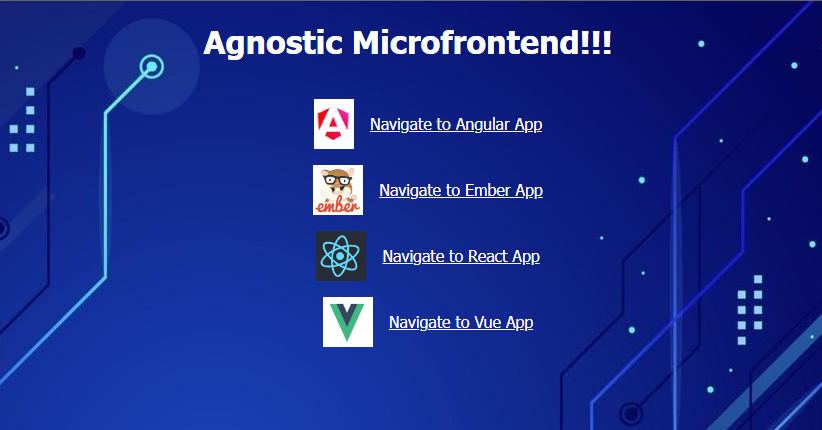
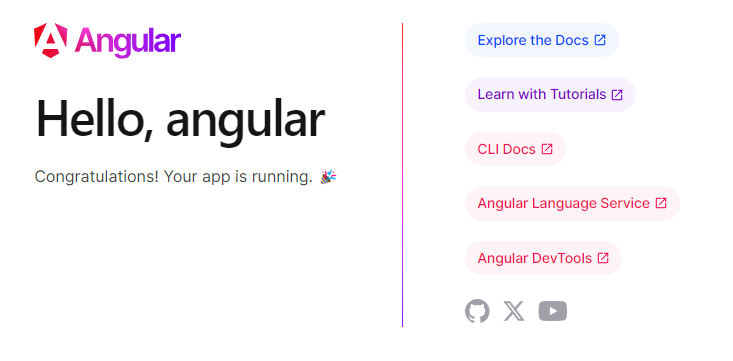
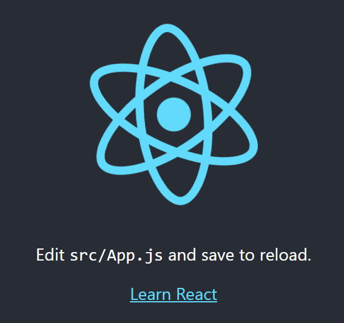

# Microfrontend NGINX with Docker
Microfrontend agnostic framework with Nginx Proxy Reverse

# Run all project by entrypoint automatically
```./entrypoint.sh```

# Application running on port 80


## /angular =>



## /ember =>


## /react =>



## /vue =>


# To run manually

## Docker compose build all apps
```docker-compose build orchestrator angular-app ember-app react-app vue-app```

## Docker compose running all apps
```docker-compose up```